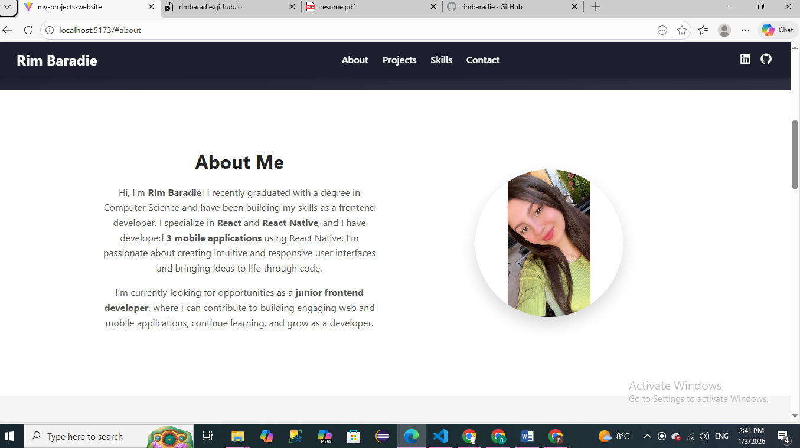
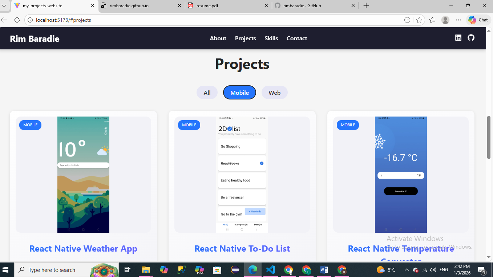
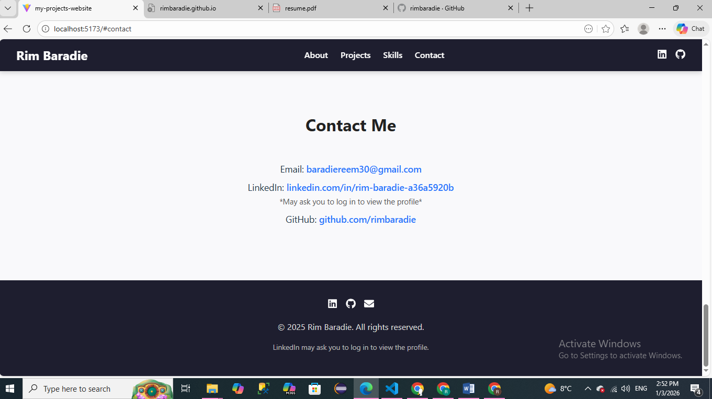

# Rim Baradie Portfolio


---

## About the Project

This is a personal portfolio website for **Rim Baradie**, showcasing:

- Projects (web and mobile apps)
- Skills (frontend, databases, tools, and programming languages)
- Contact information (email, LinkedIn, GitHub)

The portfolio is fully responsive, built with **React**, and features smooth animations with **Framer Motion**.

---

## Features

- Sticky Navbar with smooth scrolling
- Hero section with animated title and buttons
- About section with profile picture and personal info
- Projects section with filtering (Web / Mobile) and tech badges
- Skills section with animated skill cards
- Contact section with email, LinkedIn, and GitHub links
- Footer with social icons
- Fully responsive for desktop, tablet, and mobile

---

## Tech Stack

- **Frontend:** React
- **Styling:** CSS
- **Animations:** Framer Motion
- **Icons:** React Icons

---

## Screenshots

** About Section:**  


**Projects Section:**  


**Skills Section**  


**Contact Section:**  


---

## Installation & Usage

1. Clone the repository:

```bash
git clone https://github.com/rimbaradie/portfolio.git
```
